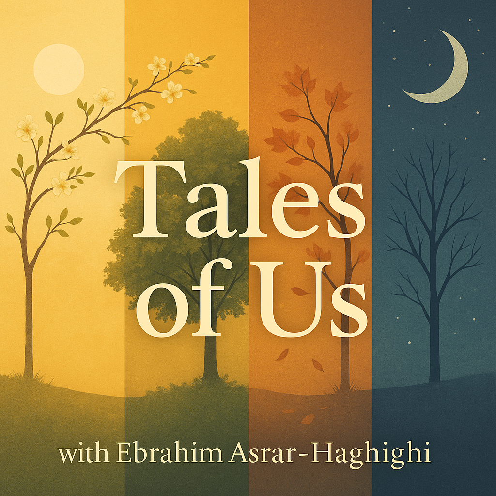

# 🎙️ Tales of Us – A Storytelling Podcast

**Tales of Us** is a personal storytelling project about memory, reconnection, and the quiet moments that shape us. It’s a narrative podcast that blends cinematic scripts, emotional voiceovers, and ambient sound design — crafted using both human creativity and AI tools.

---

## 🎧 Listen On
- [Spotify]([https://your-spotify-link-here](https://open.spotify.com/show/7ImgY7lwV9mrYWkTNNikTx))

> *“Some stories are too quiet to be heard — unless you stop and listen.”*

---

## 📚 Episodes
Scripts and summaries (no spoilers) are available in the `/episodes` folder:

- `episode1.md` — *Reunion of Hearts*
- `episode2.md` — *Coffee and Confessions*
- More coming soon...

---

## 🌟 About This Project
*Tales of Us* is not just a podcast — it's a quiet creative space. It’s written and produced as a hobby, and serves as a reminder that storytelling still matters in an AI-driven world.

No code is shared in this repository — only creative assets and background.

