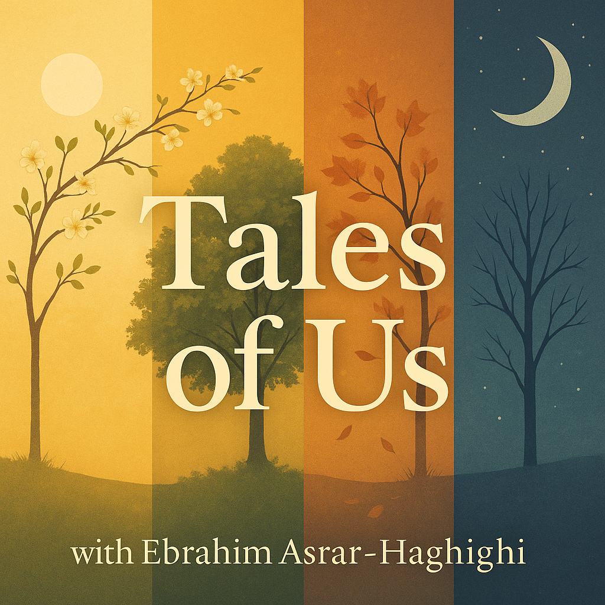

  

 *“Some stories are too quiet to be heard — unless you stop and listen.”*

---

## 📚 Season 1: *Unspoken Connections*

**A story of emotional reconnection, nostalgia, and the courage to say what was once left unsaid.**  
🎬 [Download Season 1 Teaser](seasons/Season_01_Unspoken_Connections/S01-Unspoken_Connections_Teaser.mp4)

Scripts and summaries are available in the  
`/seasons/Season_01_Unspoken_Connections/` folder:

### 🎙️ S1E1: Reunion of Hearts

In the first episode of *Unspoken Connections*, two familiar paths cross again after years apart — and what follows is a quiet, emotional unraveling of what was left unsaid.  
Set across warm coffee shops and a nostalgic hometown reunion, this story explores missed chances, unresolved emotions, and the courage to be honest, at last.  
📄 [Read script](seasons/Season_01_Unspoken_Connections/S01_E01_Reunion%20of%20Hearts.txt)  
🎧 [Listen on Spotify](https://open.spotify.com/episode/22kYjfEBYHyQbLulMQC0MI)

### 🎙️ S1E2: Coffee and Confessions

In the second episode of *Unspoken Connections*, a quiet morning after an unexpected reunion sets the stage for long-overdue truths.  
As Jason and Rebecca navigate familiar places and forgotten feelings, questions of timing, honesty, and connection begin to surface.  
Sometimes, it’s the conversations over coffee that change everything.    
📄 [Read script](seasons/Season_01_Unspoken_Connections/S01_E02_Coffee%20and%20Confessions.txt)  
🎧 [Listen on Spotify](https://open.spotify.com/episode/2cLPyX0xyZU6t3VDE5ORk6)

### 🎙️ S1E3: Road Trip Revelations

In the third episode of Unspoken Connections, a spontaneous road trip becomes the backdrop for long-suppressed emotions and honest confessions.  
As Jason and Rebecca share laughter, music, and memories along the coast, they begin to confront the fears that once kept them apart.  
Sometimes, it takes leaving everything behind to finally move forward.  
📄 [Read script](https://github.com/E-Asrar-Haghighi/tales-of-us-podcast/blob/main/seasons/Season_01_Unspoken_Connections/S01_E03_Road%20Trip%20Revelations.txt)    
🎧 [Listen on Spotify](https://open.spotify.com/episode/4ywUkRb1NHq3txxPwEMWlE)

### 🎙️ S1E4: The Language of Vulnerability

In the fourth episode of *Unspoken Connections*, Jason and Rebecca return from their road trip to face the quieter challenge of everyday openness.
Over coffee, pastries, and moments of playful banter, they begin dismantling the emotional walls that have kept them apart for years.
With each shared secret and small act of honesty, they take cautious steps toward trust, turning awkwardness into warmth and possibility.  
📄 [Read script](https://github.com/E-Asrar-Haghighi/tales-of-us-podcast/blob/main/seasons/Season_01_Unspoken_Connections/S01_E04_The%20Language%20of%20Vulnerability.txt)  
🎧 [Listen on Spotify](https://open.spotify.com/episode/2YsbBkOIofuKPSnzhZ2PUB)

---

More episodes coming soon...

---

## 🌟 About This Project

*Tales of Us* is not just a podcast — it's a quiet creative space.  
It’s written and produced as a hobby, and serves as a reminder that storytelling still matters in an AI-driven world.

> 📝 No code is shared in this repository — only creative assets and background.
